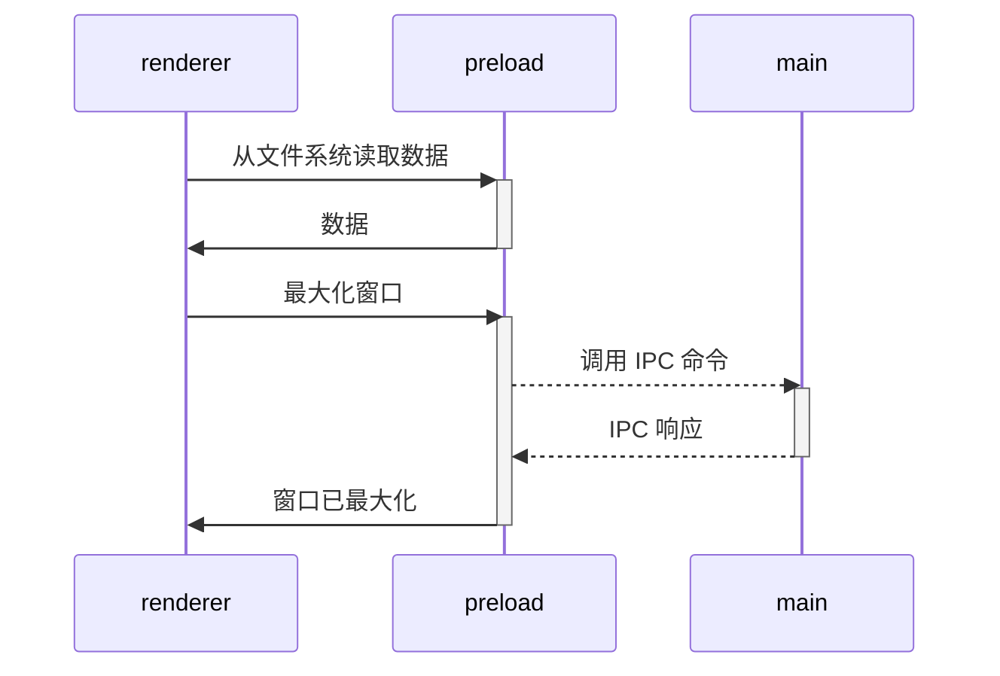

# Vite Electron Builder 模板（现代化升级版）


这是一个安全的 Electron 应用程序模板，采用最新的安全要求、建议和最佳实践编写。

**🚀 现代化升级版特性：**
- ⚡ **pnpm** - 更快的包管理器，比 npm 快 2-3 倍
- 🔧 **Biome** - 统一的代码检查和格式化工具，比 ESLint + Prettier 快 10-20 倍
- 🦀 **SWC** - 基于 Rust 的超快编译器，显著提升构建性能

## 快速开始

按照以下步骤开始使用模板：

1. 点击 **[使用此模板](https://github.com/cawa-93/vite-electron-builder/generate)** 按钮（需要登录）或直接克隆此仓库
2. 进入项目文件夹并运行 `pnpm run init`
3. 通过 `pnpm start` 在开发模式下启动应用程序
4. 通过 `pnpm run compile` 编译可执行文件

就是这么简单！😉

> [!TIP]
> 你可以在 [Deployment](https://github.com/cawa-93/vite-electron-builder/deployments) 部分探索各种框架和操作系统的演示应用程序。
> 这将让你看到应用程序在不同环境中的表现。
> 此外，你可以通过安装过时版本的应用程序来验证自动更新功能。

❤️ **如果你喜欢这个模板，请给个 ⭐ 或 [支持一下](https://www.buymeacoffee.com/kozack/)！**

## 🆕 现代化升级内容

### 包管理器升级：npm → pnpm
- **性能提升**：安装速度提升 2-3 倍
- **磁盘效率**：通过符号链接减少磁盘占用
- **更好的依赖管理**：严格的依赖解析，避免幽灵依赖

### 代码质量工具升级：ESLint + Prettier → Biome
- **统一工具**：一个工具同时处理代码检查和格式化
- **极致性能**：比传统工具链快 10-20 倍
- **零配置**：开箱即用的合理默认配置
- **AI 友好**：更好的错误信息和修复建议

### 编译器升级：集成 SWC
- **Rust 驱动**：基于 Rust 的超快编译器
- **更快的热重载**：开发时的即时反馈
- **现代化输出**：更好的代码生成和优化

### 新增脚本命令
```bash
pnpm lint          # 代码检查
pnpm lint:fix      # 自动修复代码问题
pnpm format        # 代码格式化
pnpm check         # 完整的代码质量检查
```

## 特性

### 轻量级
在设计这个模板时，我尽量保持最小化，最大程度地使用平台的原生功能，并最小化第三方依赖的数量。

### Electron
- 此模板使用最新版本的 Electron，包含所有最新的安全补丁
- 应用程序架构根据安全 [指南](https://www.electronjs.org/docs/tutorial/security) 和最佳实践构建
- 使用最新版本的 [electron-builder] 来打包应用程序

### 自动化测试
- 端到端测试位于根目录的 [`tests`](tests) 目录中，使用 [playwright]
- 你可以在每个包内编写任何单元测试，使用任何你需要的工具

### 持续集成
- 配置的工作流程将检查每次推送和 PR 的类型
- 支持代码签名。查看 [代码签名文档](https://www.electron.build/code-signing.html)

### 自动更新
每次你向 `main` 分支推送更改时，[`ci`](.github/workflows/ci.yml) 工作流程开始创建和部署新的应用程序版本，然后每个应用程序实例将下载并应用这些更新。

## 项目结构

该项目设计为 monorepo，应用程序的每个部分都是一个独立的包。
每个包可以有自己的技术栈、测试、依赖、框架等。
所有内部名称都以 `@app/*` 为前缀。
这没有技术原因，只是为了让你更容易理解架构。

最初，仓库只包含几个包。

### 构建工具包：
- [`packages/integrate-renderer`](packages/integrate-renderer) - 一个不包含在运行时的辅助包。在 `pnpm run init` 中用于配置新的界面包
- [`packages/electron-versions`](packages/electron-versions) - 一组辅助函数，用于获取 Electron 内部组件的版本

### 应用逻辑包：
- [`packages/main`](packages/main) - Electron [**主脚本**](https://www.electronjs.org/docs/tutorial/quick-start#create-the-main-script-file) 的实现
- [`packages/preload`](packages/preload) - Electron [**预加载脚本**](https://www.electronjs.org/docs/latest/tutorial/tutorial-preload) 的实现

### 渲染器未包含
如你所见，仓库**不**包含实现应用程序界面的包。
原因是由于整个应用程序是一个 mono-repository，你可以使用基于任何框架或打包器的任何 Web 应用程序作为界面包。

只有一个要求：模板期望通过 `@app/renderer` 名称导入渲染器。

> [!TIP]
> 你可以通过 `pnpm run init` 以交互模式创建新的渲染器包。

> [!NOTE]
> 如果你使用的是 vite 以外的打包器，你可能需要稍微更改 [dev-mode.js](packages/dev-mode.js) 脚本以正确运行它。

## 工作原理

### 编译可执行文件

当应用程序准备好分发时，你需要将其编译为可执行文件。我们使用 [electron-builder] 来完成这项工作。

- 你可以通过 `pnpm run compile` 在本地编译应用程序。在这种情况下，你将获得可以共享的可执行文件，但它不会开箱即用地支持自动更新。
- 要使用自动更新器，你应该编译应用程序并将其发布到一个或多个支持的分发源。在这种情况下，所有应用程序实例都将下载并应用所有新更新。这是通过 [release.yml](.github/workflows/release.yml) 中的 GitHub action 完成的。

> [!TIP]
> 此模板配置为使用 GitHub Releases 来分发更新，但你可以配置任何你需要的东西。
> 在 [electron-builder 文档](https://www.electron.build/configuration/publish) 中了解更多信息。

### 使用第三方依赖

因为 `renderer` 的工作和构建就像一个_常规的 Web 应用程序_，你只能使用支持浏览器或编译为浏览器友好格式的依赖项。

这意味着在 `renderer` 中你可以自由使用任何前端依赖项，如 Vue、React、lodash、axios 等。但是，你_不能_使用任何原生 Node.js API，如 `systeminformation`。这些 API _只_在 Node.js 运行时环境中可用，如果在 `renderer` 层中使用，会导致应用程序崩溃。相反，如果你需要在前端访问 Node.js 运行时 API，请从 `preload` 包中导出一个函数。

所有需要 Node.js api 的依赖项都可以在 [`preload` 脚本](https://www.electronjs.org/docs/latest/tutorial/process-model#preload-scripts) 中使用。

#### 在主世界中暴露

这里有一个例子。假设你需要在渲染器中从文件系统或数据库读取一些数据。

在预加载上下文中，创建一个读取并返回数据的函数。要使预加载中声明的函数在渲染中可用，你通常需要调用 [`electron.contextBridge.exposeInMainWorld`](https://www.electronjs.org/ru/docs/latest/api/context-bridge)。

但是，此模板设计为使用 ES 模块的所有功能。你可以在 `renderer` 中从 `preload` 导入任何内容。所有数据都会静默地通过 `electron.contextBridge.exposeInMainWorld()` 传递，所以你不需要担心它。

```ts
// preload/src/index.ts
import {readFile} from 'node:fs/promises';

// 如果你使用 typescript，封装类型
interface UserData {
  prop: string
}

// 将调用 `electron.contextBridge.exposeInMainWorld('getUserData', getUserData)`
export function getUserData(): Promise<UserData> {
  return readFile('/path/to/file/in/user/filesystem.json', {encoding: 'utf8'}).then(JSON.parse);
}
```

现在你可以在渲染器中导入和调用该方法

```ts
// renderer/src/anywere/component.ts
import {getUserData} from '@app/preload'

// 方法将来自暴露的上下文
// const userData = globalThis['getUserData']
const userData = await getUserData()
```

> [!TIP]
> 在 [Context Isolation 教程](https://www.electronjs.org/docs/tutorial/context-isolation#security-considerations) 中了解更多信息。

### 使用 Electron API

虽然预加载可以访问所有 Node.js API，但它**仍然在 BrowserWindow 上下文中运行**，因此只有有限的 electron 模块在其中可用。

> [!TIP]
> 查看 [electron 文档](https://www.electronjs.org/ru/docs/latest/api/clipboard) 获取可用方法的完整列表。

所有其他 electron 方法都可以在 `main` 中调用。

因此，所有模块之间交互的架构如下：



> [!TIP]
> 在 [进程间通信教程](https://www.electronjs.org/docs/latest/tutorial/ipc) 中了解更多信息。

### 模式和环境变量

所有环境变量都设置为 `import.meta` 的一部分，因此你可以通过以下方式访问它们：`import.meta.env`。

> [!NOTE]
> 如果你使用 TypeScript 并希望获得代码补全，你必须将所有环境变量添加到 [`types/env.d.ts` 中的 `ImportMetaEnv`](types/env.d.ts)。

模式选项用于指定 `import.meta.env.MODE` 的值和需要加载的相应环境变量文件。

默认情况下，有两种模式：

- `production` 默认使用
- `development` 由 `pnpm start` 脚本使用

运行构建脚本时，环境变量从项目根目录中的以下文件加载：

```
.env                # 在所有情况下加载
.env.local          # 在所有情况下加载，被 git 忽略
.env.[mode]         # 仅在指定的环境模式下加载
.env.[mode].local   # 仅在指定的环境模式下加载，被 git 忽略
```

> [!WARNING]
> 为了防止意外泄露环境变量到客户端，只有以 `VITE_` 为前缀的变量才会暴露给你的 Vite 处理的代码。

例如，让我们看看以下 `.env` 文件：

```
DB_PASSWORD=foobar
VITE_SOME_KEY=123
```

只有 `VITE_SOME_KEY` 会作为 `import.meta.env.VITE_SOME_KEY` 暴露给你的客户端源代码，但 `DB_PASSWORD` 不会。

> [!TIP]
> 你可以更改该前缀或添加另一个。查看 [`envPrefix`](https://vitejs.dev/config/shared-options.html#envprefix)。

### pnpm 脚本

```sh
pnpm start
```
在开发模式下启动应用程序，支持热重载。

---
```sh
pnpm run build
```
如果存在，在所有工作空间中运行 `build` 命令。

---
```sh
pnpm run compile
```
首先运行 `build` 脚本，然后使用指定配置的 `electron-builder` 将项目编译为可执行文件。

---
```sh
pnpm run compile -- --dir -c.asar=false
```
与 `pnpm run compile` 相同，但向 `electron-builder` 传递额外参数以禁用 asar 存档和安装程序创建。对调试编译的应用程序很有用。

---
```sh
pnpm run test
```
使用 Playwright 在**编译的应用程序**上执行端到端测试。

---
```sh
pnpm run typecheck
```
如果存在，在所有工作空间中运行 `typecheck` 命令。

---
```sh
pnpm run create-renderer
```
初始化一个名为 `renderer` 的新 Vite 项目。基本上与 `pnpm create vite` 相同。

---
```sh
pnpm run integrate-renderer
```
使用 Vite Electron builder 开始渲染器的集成过程。

---
```sh
pnpm run init
```
通过创建新的渲染器、集成它并安装必要的包来设置初始环境。

---
```sh
pnpm lint
```
使用 Biome 检查代码质量问题。

---
```sh
pnpm lint:fix
```
使用 Biome 自动修复代码质量问题。

---
```sh
pnpm format
```
使用 Biome 格式化代码。

---
```sh
pnpm check
```
运行完整的代码质量检查（linting + 类型检查）。

## 贡献

查看 [贡献指南](CONTRIBUTING.md)。

## 📖 其他语言

- [English](README.en.md) - 英文版本

[vite]: https://github.com/vitejs/vite/
[electron]: https://github.com/electron/electron
[electron-builder]: https://github.com/electron-userland/electron-builder
[playwright]: https://playwright.dev
